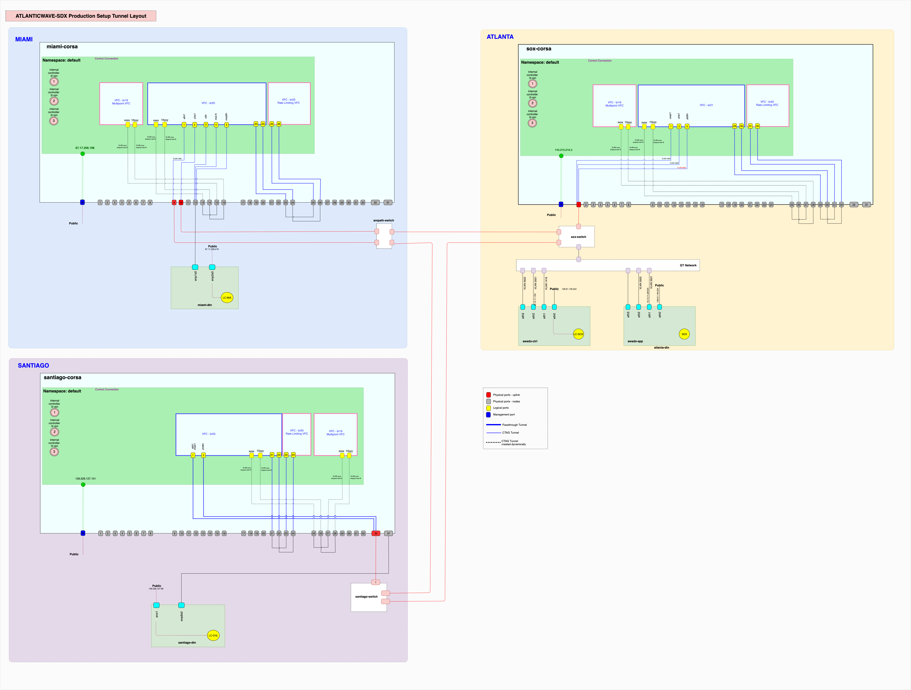

# AtlanticWave-SDX Production Testbed Setup 

## Testbed Topology

<<<<<<< HEAD


=======

>>>>>>> e1dc003a629e2e394909d351b3ec533d8cbdefe0

## Node Layout


## Tunnel Layout




```
# Out-of-band management

- Miami
- miami-corsa     : 67.17.206.198
- miami-vm        : 190.103.186.106

- Atlanta
- sox-corsa       : 143.215.216.3
- Baremetal server: 128.61.149.224
- awsdx-ctrl (VM) : 128.61.149.223
- awsdx-app (VM)  : 128.61.149.224

- Santiago
- santiago-corsa  : 139.229.127.101
- santiago-dtn    : 200.0.207.86

# OpenFlow Conrol Connection

# SDX Controller
128.61.149.224 awsdx-app sdx.atlanticwave-sdx.net

# Local Controllers 
128.61.149.223  awsdx-ctrl  lc-atl.atlanticwave-sdx.net
190.103.186.106 miami-vm    lc-mia.atlanticwave-sdx.net
200.0.207.86    santiago-vm lc-chl.atlanticwave-sdx.net

# Corsa Switches
143.215.216.3   sox-corsa      corsa-atl.atlanticwave-sdx.net
67.17.206.198   miami-corsa    corsa-mia.atlanticwave-sdx.net
139.229.127.101 santiago-corsa corsa-chl.atlanticwave-sdx.net

```

```
# In-band management
# VLANs across sites are shown on topology drawing.

# SDX Controller
10.14.11.254 sdx.atlanticwave-sdx.net

# Local Controllers
10.14.11.1    lc-atl.atlanticwave-sdx.net
10.14.11.2    lc-mia.atlanticwave-sdx.net
10.14.11.3    lc-chl.atlanticwave-sdx.net

```

## Corsa Switches

Configuration on the switches prior to the deployment is saved on the files.
- [sox-corsa](config/sox-corsa.cfg)
- [miami-corsa](config/miami-corsa.cfg)
- [chl-corsa](config/chl-corsa.cfg)

Also, backup of the active-configuration is saved on the switches.

```
corsa-sdx-56m# show file backup full 
.
├── [3.8K Jun  1  3:00:02]  corsa-sdx-56m.bkp.0.030002.12.2020.06.01.030002.tar.bz2
├── [3.8K Jun  8  3:00:02]  corsa-sdx-56m.bkp.0.030002.12.2020.06.08.030001.tar.bz2
├── [5.1K Jun  9 18:08:06]  corsa-sdx-56m.bkp.0.030002.12.2020.06.09.180806.tar.bz2
├── [3.8K Jun 15  3:00:01]  corsa-sdx-56m.bkp.0.030002.12.2020.06.15.030001.tar.bz2
├── [3.8K Jun 22  3:00:02]  corsa-sdx-56m.bkp.0.030002.12.2020.06.22.030002.tar.bz2
└── [3.4K Jun 25  2:58:11]  corsa-atl.atlanticwave-sdx.net.p12
```


Ports are set to `passthrough` mode. (ctag mode strips off the VLAN tag that prevent flows with `dl_vlan` match field being pushed properly. This can be a pure openflow behavior that needs to be elaborated.)

Openflow control connection is established through default namespace (and associated out-of-band management interface).


### Set port tunnel-modes


```
#
# sox-corsa
#

# Primary forwarding ports
configure port 1 tunnel-mode passthrough 


# Rate-limiting ports 
configure port 29 tunnel-mode passthrough 
configure port 30 tunnel-mode passthrough
configure port 31 tunnel-mode ctag
configure port 32 tunnel-mode ctag


# Multipoint Rate-limiting ports
configure port 25 tunnel-mode ctag
configure port 26 tunnel-mode ctag
configure port 27 tunnel-mode ctag
configure port 28 tunnel-mode ctag

```

```
#
# miami-corsa
#

# Primary forwarding ports
amlight-corsa# configure port 1 tunnel-mode passthrough 
amlight-corsa# configure port 2 tunnel-mode passthrough
amlight-corsa# configure port 3 tunnel-mode passthrough
amlight-corsa# configure port 4 tunnel-mode passthrough
amlight-corsa# configure port 10 tunnel-mode passthrough

# Rate-limiting ports 
amlight-corsa# configure port 23 tunnel-mode passthrough 
amlight-corsa# configure port 24 tunnel-mode passthrough
amlight-corsa# configure port 25 tunnel-mode ctag
amlight-corsa# configure port 26 tunnel-mode ctag

# Multipoint Rate-limiting ports
amlight-corsa# configure port 13 tunnel-mode ctag
amlight-corsa# configure port 14 tunnel-mode ctag
amlight-corsa# configure port 15 tunnel-mode ctag
amlight-corsa# configure port 16 tunnel-mode ctag
```


### Create VFCs 

```
#
# sox-corsa
#

# Create Primary VFC

configure bridge add br21 openflow resources 10
configure bridge br21 dpid 0xC9
configure bridge br21 tunnel attach ofport 1 port 1
configure bridge br21 tunnel attach ofport 29 port 29
configure bridge br21 tunnel attach ofport 30 port 30
configure bridge br21 controller add CONTbr21 143.215.216.21 6681

# Create Multipoint Rate-limiting VFC

configure bridge add br19 l2-vpn resources 10
configure bridge br19 controller add CONTbr19 172.17.1.1 6653 

# Create L2Tunnel Rate-limiting VFC
# by using scripts in ratelimiting-vfc directory
python make-rate-limiting-switch-clean-sox.py

```

```
#
# miami-corsa
#

# Create Primary VFC

amlight-corsa# configure bridge add br22 openflow resources 10
amlight-corsa# configure bridge br22 dpid 0xCA
amlight-corsa# configure bridge br22 tunnel attach ofport 1 port 1
amlight-corsa# configure bridge br22 tunnel attach ofport 2 port 2
amlight-corsa# configure bridge br22 tunnel attach ofport 3 port 3
amlight-corsa# configure bridge br22 tunnel attach ofport 4 port 4
amlight-corsa# configure bridge br22 tunnel attach ofport 10 port 10
amlight-corsa# configure bridge br22 tunnel attach ofport 23 port 23
amlight-corsa# configure bridge br22 tunnel attach ofport 24 port 24
amlight-corsa# configure bridge br22 controller add CONTbr22 190.103.186.106 6682


# Create Multipoint Rate-limiting VFC

amlight-corsa# configure bridge add br19 l2-vpn resources 10
amlight-corsa# configure bridge br19 controller add CONTbr19 172.17.1.1 6653 

# Create L2Tunnel Rate-limiting VFC
# by using scripts in ratelimiting-vfc directory
python make-rate-limiting-switch-clean-miami.py
```


### Rate Limiting VFC

Physical ports are in ctag tunnel-mode.
miami-corsa: Port 25 and 26 are attached to the rate-limiting VFC.
sox-corsa: Port 31 and 32 are attached to the rate-limiting VFC.

```
# Create rate limiting VFC (br20) 
configure bridge add br20 vpws resources 2
configure bridge br20 controller add Eline 172.17.2.1 6653
application eline configure connection add atlanticwave 21 22 "Rate Limiting VFC"
```

Scripts in ratelimiting-vfc can be used to delete and create the rate-limiting VFCs.

```
python make-rate-limiting-switch-clean-miami.py 
python make-rate-limiting-switch-clean-sox.py 

or 

re-create-all.sh

```


## Run SDX Controller and Local Controllers

Script `aw.sh` can be used to build docker images and run the containers for sdx and local controllers.
Type of the controller and site names are extracted from hostnames. 

```
# Build docker images
/root/aw.sh -R <REPO> -B <BRANCH> -G <CONFIG> -H <MANIFEST> -b
Default Repo: https://github.com/RENCI-NRIG/atlanticwave-proto.git
Default Branch: master
Configuration parameter maps to the directories under atlanticwave-proto/configuration (eg. renci_testbed, awave-production)
Manifest can be selected from inside the selected configuration.


/root/aw.sh -B master -G awave-production -H awave-production.manifest -b

# Run docker containers (in detached mode)
/root/aw.sh -m detached -G awave-production -H awave-production.manifest -r 

# Run docker containers (interactive)
/root/aw.sh -G awave-production -H awave-production.manifest -r 
```

