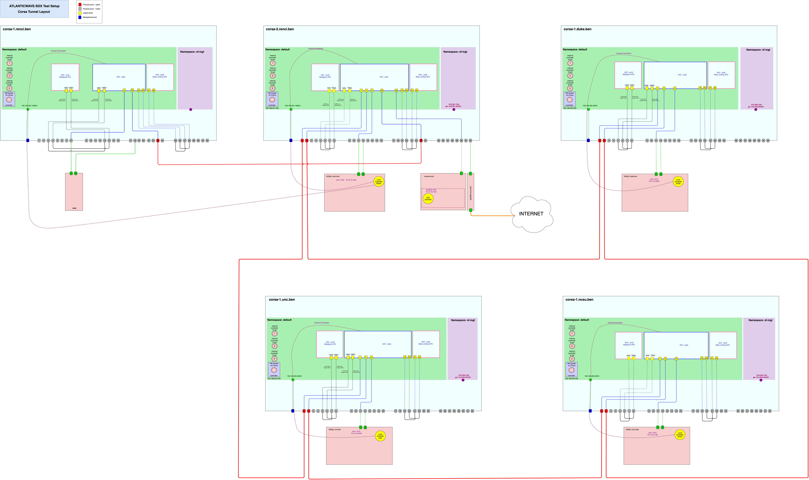

# L2Multipoint RateLimiting

## VFC Layout




## Create L2Multipoint Rate Limiting VFC

```
# RENCI
configure bridge add br19 l2-vpn resources 5
configure bridge br19 controller add CONTbr19 172.17.1.1 6653

configure port 5 tunnel-mode ctag
configure port 6 tunnel-mode ctag
configure port 7 tunnel-mode ctag
configure port 8 tunnel-mode ctag


# RENCI-2
configure bridge add br19 l2-vpn resources 5
configure bridge br19 controller add CONTbr19 172.17.1.1 6653

configure port 3 tunnel-mode ctag
configure port 13 tunnel-mode ctag
configure port 4 tunnel-mode ctag
configure port 14 tunnel-mode ctag


# DUKE 
configure bridge add br19 l2-vpn resources 5
configure bridge br19 controller add CONTbr19 172.17.1.1 6653

configure port 5 tunnel-mode ctag
configure port 6 tunnel-mode ctag
configure port 7 tunnel-mode ctag
configure port 8 tunnel-mode ctag


# UNC
configure bridge add br19 l2-vpn resources 5
configure bridge br19 controller add CONTbr19 172.17.1.1 6653

configure port 5 tunnel-mode ctag
configure port 6 tunnel-mode ctag
configure port 7 tunnel-mode ctag
configure port 8 tunnel-mode ctag


# NCSU
configure bridge add br19 l2-vpn resources 5
configure bridge br19 controller add CONTbr19 172.17.1.1 6653

configure port 5 tunnel-mode ctag
configure port 6 tunnel-mode ctag
configure port 7 tunnel-mode ctag
configure port 8 tunnel-mode ctag
```
