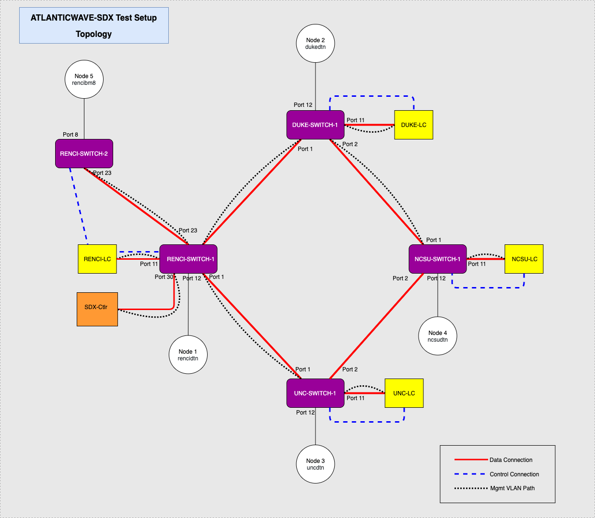
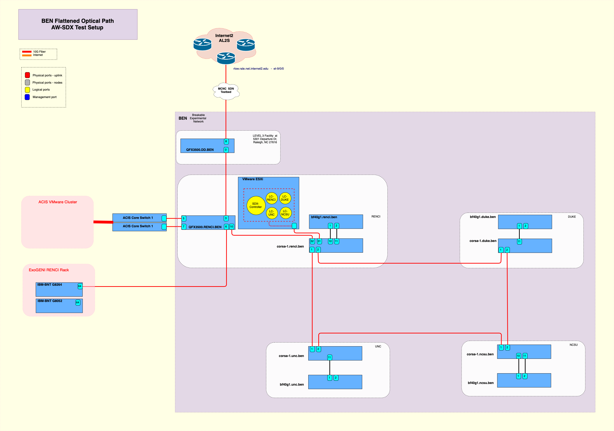
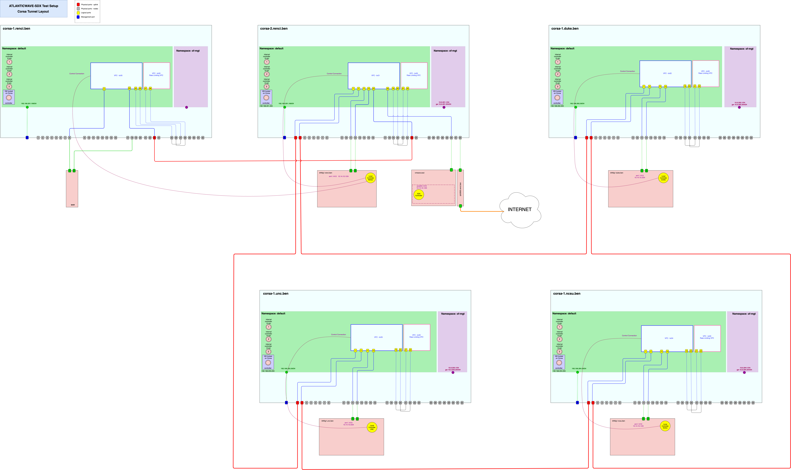

# RENCI Testbed Setup

## Testbed Topology



## Node Layout



Direct Link: https://drive.google.com/file/d/1BHdOv4X62mmVrFEbLGE5By1Nt3GNLBEo/view?usp=sharing

```
# Out-of-band management
# OpenFlow Conrol Connection

# SDX Controller
192.168.201.156 atlanticwave-sdx-controller.renci.ben

# Local Controllers (running on BF40G Nodes)
192.168.201.196   bf40g1.renci.ben  atlanticwave-lc-renci.renci.ben
192.168.202.39    bg40g1.duke.ben   atlanticwave-lc-duke.renci.ben
192.168.203.10    bg40g1.unc.ben    atlanticwave-lc-unc.renci.ben
192.168.204.21    bg40g1.ncsu.ben   atlanticwave-lc-ncsu.renci.ben

# Corsa Switches
192.168.201.168   corsa-2.renci.ben
192.168.201.169   corsa-1.renci.ben
192.168.202.30    corsa-1.duke.ben
192.168.203.30    corsa-1.unc.ben
192.168.204.30    corsa-1.ncsu.ben

```

```
# In-band management
# VLAN 1411 is used for in-band management

# SDX Controller
10.14.11.254 atlanticwave-sdx-controller.renci.ben

# Local Controllers
10.14.11.1    atlanticwave-lc-renci.renci.ben
10.14.11.2    atlanticwave-lc-duke.renci.ben
10.14.11.3    atlanticwave-lc-unc.renci.ben
10.14.11.4    atlanticwave-lc-ncsu.renci.ben

```


## Corsa Switches

Ports are set to `passthrough` mode. (ctag mode strips off the VLAN tag that prevent flows with `dl_vlan` match field being pushed properly. This can be a pure openflow behavior that needs to be elaborated.)

Openflow control connection is established through default namespace (and associated out-of-band management interface).



Direct Link: https://drive.google.com/file/d/1BHdOv4X62mmVrFEbLGE5By1Nt3GNLBEo/view?usp=sharing


Set port tunnel-modes

```
# RENCI-1
configure port 1 tunnel-mode passthrough
configure port 2 tunnel-mode passthrough
configure port 11 tunnel-mode passthrough
configure port 12 tunnel-mode passthrough
configure port 23 tunnel-mode passthrough
configure port 30 tunnel-mode passthrough
configure port 19 tunnel-mode passthrough
configure port 20 tunnel-mode passthrough

# RENCI-2
configure port 23 tunnel-mode passthrough
configure port 4 tunnel-mode passthrough
configure port 9 tunnel-mode passthrough
configure port 25 tunnel-mode passthrough
configure port 26 tunnel-mode passthrough

# DUKE
configure port 1 tunnel-mode passthrough
configure port 2 tunnel-mode passthrough
configure port 11 tunnel-mode passthrough
configure port 12 tunnel-mode passthrough
configure port 19 tunnel-mode passthrough
configure port 20 tunnel-mode passthrough

# UNC
configure port 1 tunnel-mode passthrough
configure port 2 tunnel-mode passthrough
configure port 11 tunnel-mode passthrough
configure port 12 tunnel-mode passthrough
configure port 19 tunnel-mode passthrough
configure port 20 tunnel-mode passthrough

# NCSU
configure port 1 tunnel-mode passthrough
configure port 2 tunnel-mode passthrough
configure port 11 tunnel-mode passthrough
configure port 12 tunnel-mode passthrough
configure port 19 tunnel-mode passthrough
configure port 20 tunnel-mode passthrough

```


Create VFCs on all Corsa switches

```
# RENCI-1

configure bridge add br21 openflow resources 10
configure bridge br21 dpid 0xC9
configure bridge br21 tunnel attach ofport 1 port 1
configure bridge br21 tunnel attach ofport 2 port 2
configure bridge br21 tunnel attach ofport 23 port 23
configure bridge br21 tunnel attach ofport 11 port 11
configure bridge br21 tunnel attach ofport 12 port 12
configure bridge br21 tunnel attach ofport 19 port 19 
configure bridge br21 tunnel attach ofport 20 port 20 
configure bridge br21 tunnel attach ofport 30 port 30
configure bridge br21 controller add CONTbr21 192.168.201.196 6681

# RENCI-2

configure bridge add br25 openflow resources 2
configure bridge br25 dpid 0xCD
configure bridge br25 tunnel attach ofport 23 port 23
configure bridge br25 tunnel attach ofport 4 port 4
configure bridge br25 tunnel attach ofport 9 port 9
configure bridge br25 tunnel attach ofport 25 port 25
configure bridge br25 tunnel attach ofport 26 port 26
configure bridge br25 controller add CONTbr25 192.168.201.196 6681

# DUKE

configure bridge add br22 openflow resources 10 
configure bridge br22 dpid 0xCA
configure bridge br22 tunnel attach ofport 1 port 1 
configure bridge br22 tunnel attach ofport 2 port 2 
configure bridge br22 tunnel attach ofport 11 port 11
configure bridge br22 tunnel attach ofport 12 port 12
configure bridge br22 tunnel attach ofport 19 port 19 
configure bridge br22 tunnel attach ofport 20 port 20 
configure bridge br22 controller add CONTbr22 192.168.202.39 6682

# UNC

configure bridge add br23 openflow resources 10 
configure bridge br23 dpid 0xCB
configure bridge br23 tunnel attach ofport 1 port 1 
configure bridge br23 tunnel attach ofport 2 port 2 
configure bridge br23 tunnel attach ofport 11 port 11
configure bridge br23 tunnel attach ofport 12 port 12
configure bridge br23 tunnel attach ofport 19 port 19 
configure bridge br23 tunnel attach ofport 20 port 20 
configure bridge br23 controller add CONTbr23 192.168.203.10 6683

# NCSU

configure bridge add br24 openflow resources 10 
configure bridge br24 dpid 0xCC
configure bridge br24 tunnel attach ofport 1 port 1 
configure bridge br24 tunnel attach ofport 2 port 2 
configure bridge br24 tunnel attach ofport 11 port 11 
configure bridge br24 tunnel attach ofport 12 port 12 
configure bridge br24 tunnel attach ofport 19 port 19 
configure bridge br24 tunnel attach ofport 20 port 20 
configure bridge br24 controller add CONTbr24  192.168.204.21 6684

```

```
# Rate Limiting VFC
# Create rate limiting VFC (br20) on RENCI-1 | RENCI-2 | DUKE | UNC | NCSU
configure bridge add br20 vpws resources 2
configure bridge br20 controller add Eline 172.17.2.1 6653
application eline configure connection add atlanticwave 21 22 "Rate Limiting VFC"

python make-rate-limiting-switch-clean-renci.py 
python make-rate-limiting-switch-clean-duke.py 
python make-rate-limiting-switch-clean-unc.py 
python make-rate-limiting-switch-clean-ncsu.py 
python make-rate-limiting-switch-clean-renci-2.py

```


## Run Controllers

Script `aw.sh` can be used to build docker images and run the containers for sdx and local controllers.
Type of the controller and site names are extracted from hostnames. 

```
# Build docker images
/root/aw.sh -b

# Run docker containers
/root/aw.sh -r 

```

